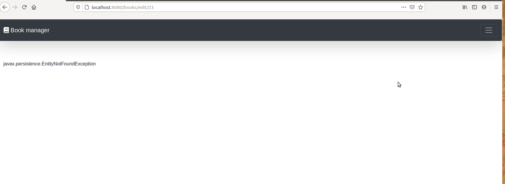

# BookApi2
Continue of developing BookApi (adding Hibernate)
* Functions of app:
1. Show list of books
2. Show Detai of Book
3. Edit each book
4. Delete book
## Used
- Spring
- Hibernate
- Dependency Injection
- External libraries
- Thymeleaf templates
- Bootstrap

